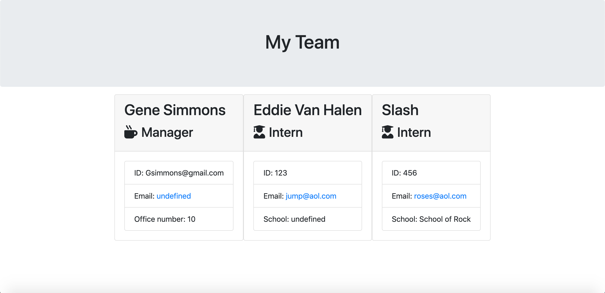

# Team-Profile-Application

## Description and Objectives
The main goal of this project is to build a software engineering team generator command line application.

## Installation and usage
In order to run this project, the user must have Node.js installed,  and must install the inquirer package as well as util. 

The application will prompt the user for information about the team manager and then information about the team members. The user can input any number of team members, and they may be a mix of engineers and interns. When the user has completed building the team, the application will create an HTML file that displays a well formatted team roster based on the information provided by the user. 

## Features
HTML, Javascript, and Node.js are the languages and platforms used to create this project. 

[GitHub repository](https://github.com/sean-akene/Team-Profile-Application)

